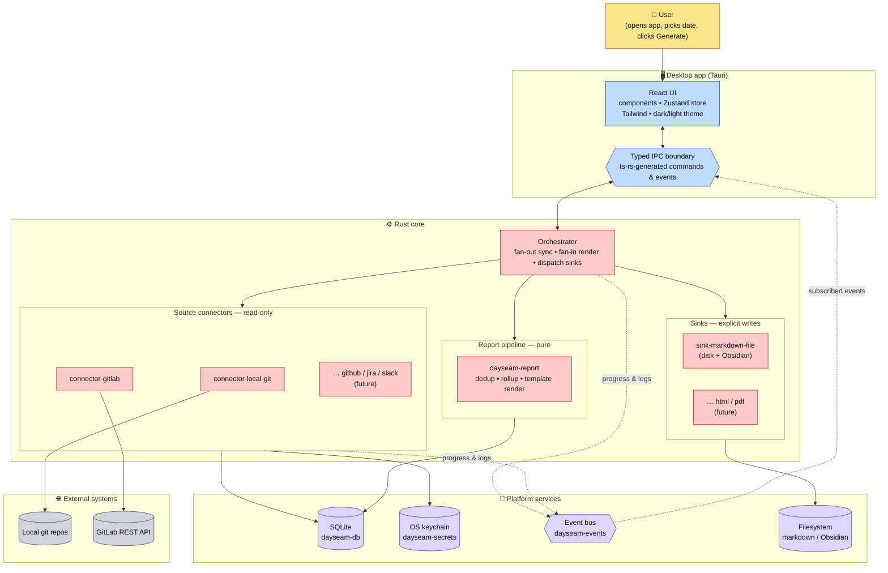
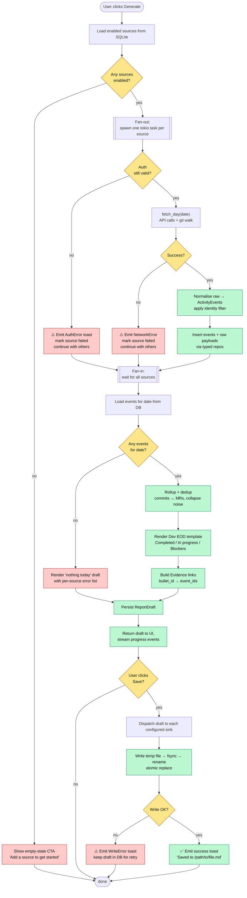
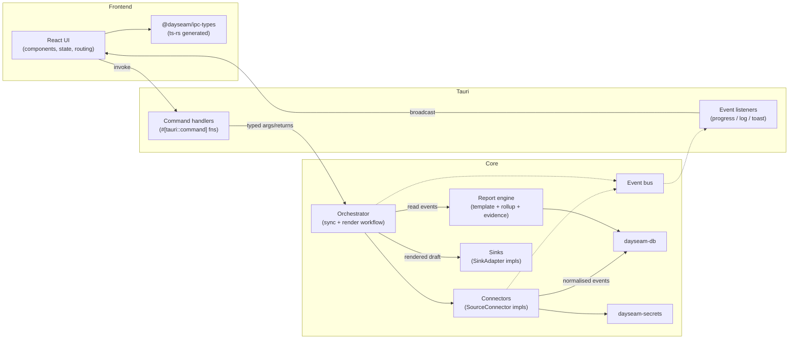
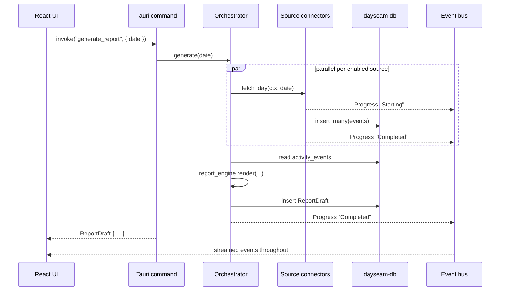
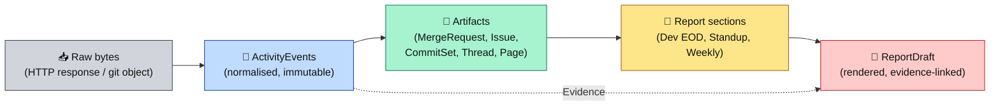
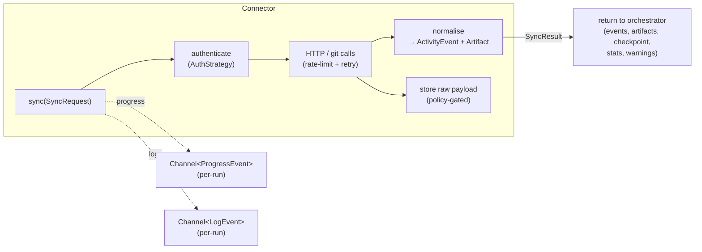

# Dayseam — Architecture & Roadmap

> **Status:** living document. Updated with every non-trivial change to the
> system's shape. If a PR changes architecture or the roadmap, it should
> touch this file.

This document is the canonical top-down view of Dayseam. It tells you what
the product is, how the code is organised, how data flows at runtime, how
to extend it with new connectors or sinks, and what ships in each release.
Deeper detail lives in the dated design and plan documents referenced at
the end.

---

## Table of contents

1. [Product vision](#1-product-vision)
2. [First principles](#2-first-principles)
3. [System at a glance — visual tour](#3-system-at-a-glance--visual-tour)
4. [Repository layout](#4-repository-layout)
5. [Runtime architecture](#5-runtime-architecture)
6. [The IPC boundary](#6-the-ipc-boundary)
7. [Domain model](#7-domain-model)
   - [7A. The canonical artifact layer](#7a-the-canonical-artifact-layer)
8. [Connectors — how sources plug in](#8-connectors--how-sources-plug-in)
9. [Sinks — how destinations plug in](#9-sinks--how-destinations-plug-in)
10. [Report engine](#10-report-engine)
11. [Persistence, secrets, and events](#11-persistence-secrets-and-events)
    - [11.4. Raw payload retention policy](#114-raw-payload-retention-policy)
12. [Security and privacy](#12-security-and-privacy)
13. [Testing strategy](#13-testing-strategy)
14. [Release engineering](#14-release-engineering)
    - [14.1. Key custody](#141-key-custody)
15. [Roadmap](#15-roadmap)
16. [Explicit non-goals](#16-explicit-non-goals)
17. [Related documents](#17-related-documents)

---

## 1. Product vision

Dayseam turns the work you already did — commits, merge requests, issue
activity, messages, tickets — into a trustworthy, evidence-backed report
that lives as markdown on your machine. It is a **personal** reporting
assistant: you connect the tools you use, pick a date, and Dayseam
produces a draft you can edit and save. It never sends anything on your
behalf, never uploads your data, and never replaces the sentences you
write with ones a model made up.

The long-term shape is a pluggable, cross-platform app where the user owns
their data end-to-end and can bolt on new sources (Jira, Slack, Confluence,
GitHub, custom corporate tools) one at a time without re-architecting.

## 2. First principles

These are the decisions that predate the code and constrain every change:

1. **Local-first by default.** State, secrets, and raw payloads live on
   the user's machine. No mandatory account. No background upload.
2. **Draft-first, never auto-send.** The app produces a markdown draft.
   The user reviews and writes to disk themselves.
3. **Every sentence traces back to evidence.** Each bullet in a report
   references the activity events that produced it. The UI surfaces that
   link on demand so users can verify claims.
4. **Read-only source connectors; explicit write connectors.** A
   connector that *reads* from GitLab is a different class of thing from
   a connector that *writes* to Obsidian, and they travel through
   different traits and code paths.
5. **AI rewrite is optional polish, never the source of truth.** The
   report engine is deterministic; LLM passes only mutate prose style.
6. **Compile-time pluggable, not runtime plugins.** New sources and sinks
   are new crates inside this monorepo, contributed by PR, and shipped in
   a new build. The core dispatches on `SourceKind` / `SinkKind` enums;
   there is no plugin loader, no subprocess boundary, no WASI host.
   Runtime plugins are a future architecture shift (post-1.0, demand-led),
   not something v0.x pretends to support.
7. **Never fail silently.** Every failure surfaces as a toast, a log
   entry, and an error state the user can click into.
8. **No background work without explicit user opt-in.** v0.1–v0.3 are
   foreground-only: schedules fire only while the app is running. v0.4
   introduces an opt-in OS-level agent (macOS `LaunchAgent` / Windows
   Scheduled Task / Linux user-level systemd unit) that the user enables
   from settings and can revoke at any time. Nothing runs before the
   user says yes.
9. **Tested end-to-end.** Unit, contract (recorded fixtures), golden,
   and property-based tests land with the code they cover.

## 3. System at a glance — visual tour

Four complementary views of the same system. Skim them top-to-bottom
before reading the prose sections; they answer the questions "what talks
to what", "what happens when I click generate", "how do I add a new
source", and "what ships when".

### 3.1 Layered architecture — what lives where

Block-diagram view of every subsystem. User sits at the top, external
systems at the bottom, with the Tauri boundary and the Rust core
sandwiched between. Solid arrows are synchronous calls; dashed arrows
are event-bus broadcasts.



### 3.2 Request lifecycle — "Generate report for date X"

End-to-end flowchart of what happens between the user clicking Generate
and a markdown file landing on disk. Every diamond is a real decision
point in the orchestrator; every red path is a failure mode that
surfaces as a toast rather than a silent drop.



### 3.3 Plugin model — adding a new connector

A step-by-step flowchart of the work involved in adding, say,
`connector-github` in v0.2. This is the single most frequent extension
we expect to do, so the flow is deliberately mechanical and
documentation-driven.

```mermaid
flowchart TD
    Start([I want to add a new source<br/>e.g. connector-github]) --> S1

    S1["<b>1.</b> Create crate<br/><code>crates/connectors/connector-github/</code><br/>depends only on dayseam-core,<br/>connectors-sdk, dayseam-events"]
    S1 --> S2["<b>2.</b> Add <code>SourceKind::GitHub</code> variant<br/>to dayseam-core<br/>(additive enum — safe)"]
    S2 --> S3["<b>3.</b> Add <code>SourceConfig::GitHub {…}</code> variant<br/>stored as JSON in sources.config_json<br/>(no DB migration needed)"]
    S3 --> S4["<b>4.</b> Implement <code>SourceConnector</code><br/>• kind()<br/>• healthcheck()<br/>• fetch_day(date)"]
    S4 --> S5["<b>5.</b> Pick an <code>AuthStrategy</code><br/>PAT first, OAuth later"]
    S5 --> S6{Need a new<br/>ActivityKind?}
    S6 -- no --> S7
    S6 -- yes --> S6b["<b>5b.</b> Extend ActivityKind enum<br/>(additive) + update helpers in dayseam-db"]
    S6b --> S7

    S7["<b>6.</b> Write tests<br/>• contract tests with <code>wiremock</code><br/>• normalisation unit tests<br/>• error-path golden tests<br/>• property tests for serde"]
    S7 --> S8["<b>7.</b> Register in orchestrator<br/>one-line <code>match</code> arm on SourceKind"]
    S8 --> S9["<b>8.</b> Regenerate ts-rs types<br/><code>cargo test -p dayseam-core --test ts_types_generated</code><br/>commit <code>packages/ipc-types/src/generated/</code>"]
    S9 --> S10["<b>9.</b> Add UI config panel<br/>driven by new SourceConfig variant"]
    S10 --> S11["<b>10.</b> Update docs<br/>• ARCHITECTURE.md §15 roadmap entry<br/>• CHANGELOG.md<br/>• design doc for the release"]
    S11 --> Done([Ship PR with semver:minor])

    classDef core fill:#bfdbfe,stroke:#1e40af,color:#111
    classDef test fill:#bbf7d0,stroke:#047857,color:#111
    classDef wire fill:#fecaca,stroke:#b91c1c,color:#111
    classDef docs fill:#fde68a,stroke:#b45309,color:#111

    class S1,S2,S3,S4,S5,S6b core
    class S7 test
    class S8,S9,S10 wire
    class S11 docs
```



The equivalent flow for a new **sink** is identical in shape: create
`crates/sinks/sink-<name>/`, add `SinkKind`/`SinkConfig` variants,
implement `SinkAdapter`, add atomic-write tests, register in the sink
dispatcher, add UI config, regenerate types, document.

### 3.4 Release roadmap — versioned flow

The order things ship in, and the one-line thesis that justifies each
release being its own shipping unit. Green is current work; grey is
post-1.0 and deliberately deferred until real demand shows up.

```mermaid
flowchart LR
    V01["<b>v0.1</b> — in progress<br/>Mac app<br/>local-git + GitLab<br/>markdown / Obsidian sink"]:::current
    V02["<b>v0.2</b><br/>+ GitHub, Jira<br/>+ multi-identity<br/>+ multi-day windows<br/>+ more templates"]
    V03["<b>v0.3</b><br/>+ scheduler<br/>+ first-run approval<br/>+ offline-first retries<br/>+ explain-evidence panel"]
    V04["<b>v0.4</b><br/>+ Slack, Confluence<br/>+ privacy-first defaults<br/>+ prompt-injection<br/>  test suite"]
    V05["<b>v0.5</b><br/>+ optional AI rewrite<br/>  (BYO key / local LLM)<br/>+ per-bullet diff accept"]
    V06["<b>v0.6</b><br/>+ Windows<br/>+ Linux<br/>+ secret-store abstraction"]
    V07["<b>v0.7</b><br/>+ read-only web companion<br/>  over local HTTPS tunnel"]
    V10["<b>v1.0</b><br/>stable API<br/>signed binaries, 3 OSes<br/>docs site<br/>security review"]:::stable
    VB["<b>beyond v1.0</b><br/>team SKU (intentional fork)<br/>healthcare (own compliance)<br/>Teams / Zoom / Office"]:::future

    V01 --> V02 --> V03 --> V04 --> V05 --> V06 --> V07 --> V10 --> VB

    classDef current fill:#10b981,color:#fff,stroke:#047857,stroke-width:3px
    classDef stable fill:#2563eb,color:#fff,stroke:#1e3a8a,stroke-width:3px
    classDef future fill:#9ca3af,color:#fff,stroke:#4b5563,stroke-dasharray:5 5
```



Dayseam is a Tauri desktop app: a single binary bundling a Rust core and
a React frontend served from a local WebView. Everything the user sees is
rendered in React; everything that touches the filesystem, the network,
or a secret runs in Rust. The two halves communicate through a typed IPC
boundary whose shapes are generated from the Rust domain types via
`ts-rs`. The remaining sections drill into each of the boxes above.

## 4. Repository layout

The repository is a single git tree with two parallel workspaces — one
Cargo, one pnpm — deliberately co-located so a single PR can carry both
sides of a feature.

```
dayseam/
├── apps/
│   └── desktop/                # Tauri app shell
│       ├── src/                # React + TS + Tailwind frontend
│       └── src-tauri/          # Rust-side entrypoint for the Tauri app
├── crates/
│   ├── dayseam-core            # Domain types, error taxonomy, ts-rs bindings
│   ├── dayseam-db              # SQLite layer: migrations + typed repos
│   ├── dayseam-secrets         # Secret<T> + Keychain store
│   ├── dayseam-events          # Progress / log / toast bus (broadcast)
│   ├── dayseam-report          # Deterministic report engine + templates
│   ├── connectors-sdk          # SourceConnector trait + HttpClient + auth
│   ├── connectors/             # Per-source crates (added one at a time)
│   │   ├── connector-local-git
│   │   └── connector-gitlab
│   ├── sinks-sdk               # SinkAdapter trait
│   └── sinks/                  # Per-destination crates
│       └── sink-markdown-file
├── packages/
│   ├── ipc-types               # TypeScript types generated from dayseam-core
│   └── ui                      # Reusable React component library (shadcn-like)
├── docs/
│   ├── design/                 # Dated design docs (v0.1, v0.2, …)
│   ├── plan/                   # Dated implementation plans per phase
│   └── ARCHITECTURE.md ←── you are here (at repo root)
├── scripts/                    # CI + release + dev helpers
├── .github/workflows/          # CI pipelines, semver-label enforcement
├── Cargo.toml                  # Rust workspace manifest
├── pnpm-workspace.yaml         # JS workspace manifest
├── VERSION                     # Single source of truth for app version
└── CHANGELOG.md
```

Rules that keep the tree honest as it grows:

- **One concern per crate.** A connector crate depends only on
  `dayseam-core`, `connectors-sdk`, and `dayseam-events`. It does not
  reach into `dayseam-db` directly — the orchestrator is what persists
  results.
- **No shared "common" crate.** If two crates need a helper, it either
  lives in `dayseam-core` (if it's a domain type) or gets copied (if
  it's local utility). We'd rather duplicate three lines than grow a
  shared utility junk drawer.
- **Frontend never imports Rust.** It imports only types from
  `@dayseam/ipc-types`. Behaviour crosses the boundary through
  `invoke`-based commands.

## 5. Runtime architecture



### 5.1 Backend (Rust core)

The Rust core is the brain. Responsibilities, top-down:

- **Orchestrator.** Owns the lifecycle of a "generate report for date X"
  request. Dispatches fan-out to every enabled source, waits for them in
  parallel, hands the aggregated events to the report engine, persists
  the draft, then hands it to the configured sinks on user action.
- **Connectors.** Each connector is a crate implementing the
  `SourceConnector` trait. The trait hides everything a source-specific
  concern needs: auth, HTTP, parsing, rate-limit handling, identity
  mapping. Connectors write only through the orchestrator; they don't
  talk to SQLite directly.
- **Report engine.** Pure, deterministic. Takes `Vec<ActivityEvent>` plus
  a template id, returns a `ReportDraft`. Uses a rollup/dedup step to
  collapse related events (a local commit + its GitLab MR → one bullet)
  and produces `Evidence` links from bullet ids back to event ids.
- **Sinks.** Write-side plugins. Given a `ReportDraft`, serialise it
  into whatever format the destination expects (markdown with marker
  blocks, HTML, PDF). Explicit per call; never scheduled on the user's
  behalf in v0.1.
- **Persistence layer (`dayseam-db`).** Single SQLite file, migrations
  via `sqlx::migrate!`. Typed repositories (`SourceRepo`, `ActivityRepo`,
  `DraftRepo`, …) are the only way the rest of the system talks to the
  database.
- **Secrets (`dayseam-secrets`).** `Secret<T>` wrapper + `SecretStore`
  trait. In production: macOS Keychain. In tests: `InMemoryStore`.
- **Event bus (`dayseam-events`).** `tokio::sync::broadcast`-based fanout
  of `ProgressEvent`, `LogEvent`, `ToastEvent`. Non-blocking publishers;
  slow subscribers get `Lagged` errors and recover by resubscribing.

### 5.2 Frontend (Tauri + React)

- **React + TypeScript + Tailwind + Vite.** Functional components, hooks
  only; no class components.
- **State.** Local React state for UI ephemera; a small Zustand (or
  equivalent) store for cross-component state like the current report
  draft and the event feed. No Redux.
- **IPC types.** Imported from `@dayseam/ipc-types`, which re-exports the
  TypeScript definitions `ts-rs` generates from the Rust domain types.
  The frontend cannot define a backend shape — it imports or nothing.
- **Theming.** Light / dark / system, driven by a CSS variable palette
  and Tailwind's `dark:` modifier.
- **Accessibility.** Keyboard-first: every action a mouse can do must be
  reachable from the keyboard with a visible focus ring.
- **Log drawer + toasts.** Mirror the Rust event bus: a bottom drawer
  shows structured log entries; short-lived toasts surface success,
  warning, and error signals.

### 5.3 The IPC boundary in one diagram



## 6. The IPC boundary

This is the single most important interface in the codebase. Every piece
of state that crosses it is a Rust type with `#[derive(Serialize,
Deserialize, TS)]` in `dayseam-core`. The TypeScript equivalents are
regenerated from the Rust source and committed to
`packages/ipc-types/src/generated/`. An integration test
(`ts_types_generated`) runs `git status --porcelain` against that
directory and fails CI if the two ever drift.

Consequences:

- Changing a backend type always ships with a regenerated frontend type
  in the same PR. Nothing else is legal.
- Adding a new command does **not** require a new trait — Tauri commands
  are plain async Rust functions. What it *does* require is types for
  args and return, and those types live in `dayseam-core`.

**Three transports, three purposes.** Tauri gives us three IPC
mechanisms, and we use each for exactly one job:

| Transport | Used for | Rationale |
|---|---|---|
| **Commands** (`#[tauri::command] async fn …`) | Request / response. "Generate a report for this date." "Save this draft to sink X." | Typed, awaitable, error-bearing. |
| **Channels** (`Channel<T>` passed as a command argument) | Per-run ordered streams — progress events, log lines, artifact-appearing events during a sync run. | Tauri's documented path for low-latency / high-throughput ordered data. Each `SyncRun` opens a channel; drops automatically when the run ends. |
| **Global events** (`Manager::emit`) | Small, app-wide, infrequent signals — toasts, "settings changed", "update available". | Tauri's event system is documented as small-and-simple messaging, JSON-string payloads. We don't use it for streams. |

**Capabilities.** Tauri allows all commands by default unless the
capabilities config narrows them. We invert that: the frontend's
capability manifest lists **exactly** the commands the UI is allowed to
invoke. Adding a new command is a two-file change (Rust handler + one
entry in `tauri.conf.json` capabilities). This is documented as part
of the architecture because silently-growing command surface is a real
security smell and we want reviewers to notice.

## 7. Domain model

The central types (all in `dayseam-core`). The data pipeline is
deliberately layered — **raw bytes → normalised events → canonical
artifacts → report sections → rendered draft** — and the types below
carry those layers:

| Layer | Type | Purpose |
|---|---|---|
| Config | `Source` / `SourceKind` / `SourceConfig` | One configured connector. `SourceConfig` is a per-kind enum so adding a new source kind is an additive schema change. Every `SourceConfig` carries a `config_version: u16` so future upgrades can migrate blobs without a DB schema change. |
| Config | `LocalRepo` | An approved local git directory. `is_private` drives redaction. |
| Identity | `Person` | One human. v0.1 has a single row with `is_self = true`. The type exists now so multi-identity in v0.2 is additive, not a rewrite. |
| Identity | `SourceIdentity` | `{ person_id, source_id, external_actor_id, kind }` — maps a per-source actor id (email, `gitlab_user_id`, `github_login`, …) to a canonical `Person`. The filter "was this authored by me?" is a `SourceIdentity` lookup. Fuzzy-match metadata (`confidence`, `provenance`, `manual_override`) intentionally **deferred** to v0.2 when real cross-source ambiguity shows up. |
| Raw | `RawPayload` | Original bytes from the source, optionally compressed (zstd). Subject to retention policy (see §11.4). Referenced by `RawRef`. |
| Evidence | `ActivityEvent` | One normalised piece of evidence — a commit, an MR open, an issue comment. Every bullet in a report traces back to one or more of these. |
| Evidence | `ActivityKind` | Enum discriminator: `CommitAuthored`, `MrOpened`, `IssueComment`, … |
| Canonical | `Artifact` / `ArtifactKind` | The **middle layer** between events and report sections. Examples: `MergeRequest`, `Issue`, `CommitSet`, `Thread`, `Page`. Events belong to zero-or-one artifact via `artifact_id`; artifacts are how the report engine talks about "this MR happened" without re-inferring it from raw events. See §7A. |
| Output | `ReportDraft` | One rendered report. Carries sections, bullets, per-source run state, and evidence links. |
| Output | `Evidence` | Edge from a bullet id to the `ActivityEvent` ids that produced it. Evidence always points at events, not artifacts — so "explain this bullet" always shows the primary sources. |
| Runs | `SyncRun` | `{ run_id, started_at, finished_at, trigger, per_source_state, cancel_reason, superseded_by }`. A first-class record of every sync. Cancellation sets `cancel_reason` and stops emitting on that run's channels. Late results from a superseded run are dropped at persist time. |
| Runs | `Checkpoint` | Per-source opaque bytes persisted per `SyncRun`, used by `SyncRequest::Since(Checkpoint)` for incremental sync. Shape is whatever the connector wants (ETag, last-modified timestamp, cursor token). |
| Telemetry | `SourceHealth` | Success / failure telemetry on the source row itself, surfaced to the UI. |
| Telemetry | `LogEntry` | Structured log row persisted in SQLite. The event bus is for UX; `log_entries` is the audit/debug surface ("why did Tuesday's report miss those commits?"). |
| Errors | `DayseamError` | The single cross-crate error type. Structured serde tagging (`variant` + `data`) means the frontend gets machine-readable errors with stable codes. |

The schema in SQLite mirrors these 1:1. See
[`docs/design/2026-04-17-v0.1-design.md` §5.2](docs/design/2026-04-17-v0.1-design.md)
for the v0.1 starting point — the `Person` / `SourceIdentity` / `Artifact`
/ `SyncRun` tables land when the crate that owns them lands, with an
additive migration per introduction.

## 7A. The canonical artifact layer

The single biggest architectural change over "just a bag of events" is
that Dayseam's pipeline has an explicit middle layer. Without it, every
report template has to re-derive "these 3 commits and this branch name
belong under MR !42" from scratch, which is how you end up with a
heuristic soup that no-one can reason about.



Properties that make this layer pay off:

- **Artifacts are per-source.** The GitLab connector produces
  `Artifact::MergeRequest { iid, project, title, state, … }` in the same
  pass as its events. It owns the grouping logic — the orchestrator
  and the report engine don't guess.
- **Events declare their artifact.** An `ActivityEvent` has an optional
  `artifact_id` foreign key. A commit that's part of an MR points at
  that MR; a standalone commit to `master` has `artifact_id = None` and
  renders under its own bullet.
- **Cross-source linking lives on the artifact, not in templates.** When
  v0.2 adds Jira, a `JIRA-123` token in an MR title becomes a link on
  the `MergeRequest` artifact pointing at the `Issue` artifact. The
  template just iterates artifacts; it doesn't pattern-match strings.
- **Evidence still points at events.** A bullet rendered from an
  artifact cites the events underneath it ("3 commits, 1 MR opened, 2
  review comments"), not the artifact itself. "Explain this bullet"
  takes the user to primary sources every time.
- **Dedup is an artifact-layer operation.** Two events about the same
  MR from two different refreshes of the same sync merge into one
  artifact, not a hand-written de-duplication pass per template.

## 8. Connectors — how sources plug in

A connector is a crate under `crates/connectors/` that implements one
trait. Everything else about the source (HTTP, parsing, auth) is its own
internal concern.

### 8.1 The `SourceConnector` contract

```rust
#[async_trait]
pub trait SourceConnector: Send + Sync {
    fn kind(&self) -> SourceKind;

    async fn healthcheck(&self, ctx: &ConnCtx) -> Result<HealthInfo, DayseamError>;

    /// Fetch activity for a request window. Supports single days, explicit
    /// ranges, and incremental (checkpoint-driven) sync.
    async fn sync(
        &self,
        ctx: &ConnCtx,
        request: SyncRequest,
    ) -> Result<SyncResult, DayseamError>;
}

pub enum SyncRequest {
    Day(NaiveDate),
    Range { start: NaiveDate, end: NaiveDate },
    Since(Checkpoint),
}

pub struct SyncResult {
    pub events: Vec<ActivityEvent>,
    pub artifacts: Vec<Artifact>,
    pub checkpoint: Option<Checkpoint>,
    pub stats: SyncStats,       // counts, rate-limit remaining, etc.
    pub warnings: Vec<Warning>, // non-fatal things the UI should surface
}

pub struct ConnCtx<'a> {
    pub source_id: SourceId,
    pub run_id: RunId,                // bound to the current SyncRun
    pub person: &'a Person,           // the canonical "me"
    pub source_identities: &'a [SourceIdentity],
    pub auth: Box<dyn AuthStrategy>,
    pub progress: Channel<ProgressEvent>, // per-run ordered stream
    pub logs: Channel<LogEvent>,          // per-run ordered stream
    pub raw_store: RawStore,
    pub clock: Clock,
    pub http: HttpClient,
    pub cancel: CancellationToken,    // checked at safe points
}
```

Design choices worth calling out:

1. **One `sync` method, three request kinds.** `Day(date)` is the only
   form v0.1 connectors see. `Range` arrives in v0.2 with multi-day
   reporting. `Since(Checkpoint)` arrives in v0.3 with the scheduler and
   lets connectors that support incremental fetch do so. Connectors that
   *don't* support `Since` return
   `Err(DayseamError::Unsupported { … })` and the orchestrator falls
   back to the equivalent `Range`. No trait rewrite between v0.1 and
   v0.3.
2. **`SyncResult` carries both events and artifacts.** Connectors are
   best placed to build canonical artifacts (they know that commits
   `a1b2c` and `c3d4e` belong under MR `!42`). Returning both in one
   call means the orchestrator never has to re-infer grouping.
3. **Connectors receive per-run typed channels, not an event bus
   handle.** `progress` and `logs` are Tauri-style channels scoped to
   `run_id`. Cancel the run, the channels close. No risk of a superseded
   run's progress painting over a newer run's UI.
4. **Cancellation is explicit.** `ctx.cancel` is a `CancellationToken`
   the connector is expected to poll at loop boundaries. The
   orchestrator cancels runs on user request, on app shutdown, and when
   a newer run for the same `(source, date)` starts.
5. **Authentication is a durable per-source strategy.** `AuthStrategy`
   is a trait, and each source's `SourceConfig` variant owns its own
   auth field. v0.1 ships PAT for local-git (none needed) and GitLab.
   When each later source arrives, it picks whatever auth its own docs
   recommend: Jira Cloud gets 3LO OAuth, Jira DC gets PAT, GitHub gets
   GitHub App (preferred) or fine-grained PAT. PAT is not a temporary
   v0.1 placeholder — it is a valid durable strategy for single-user,
   self-hosted cases.

### 8.2 Data flow through a connector



Every normalised `ActivityEvent` carries a `RawRef` pointing at the raw
payload, and every `Artifact` exposes its constituent event ids. The
report engine reads only normalised events and artifacts, so a retention
sweep that prunes old raw payloads (see §11.4) never breaks a report.

### 8.3 Recipe: adding a new connector

Assume we're adding `connector-github` in v0.2. The full change set:

1. **Create the crate.** `crates/connectors/connector-github/` with a
   `Cargo.toml` that depends on `dayseam-core`, `connectors-sdk`, and
   whatever HTTP/parsing it needs. Per-run channels come in via
   `ConnCtx`, not a bus handle, so no `dayseam-events` dependency.
2. **Add `SourceKind::GitHub`** to `dayseam-core` (additive, safe).
3. **Add `SourceConfig::GitHub { … , config_version }` variant.**
   Persisted as JSON; `config_version: u16` so future upgrades can
   migrate blobs without a DB schema change.
4. **Add `ArtifactKind` variants** you produce (e.g.
   `PullRequest`, `Issue`) if they aren't already covered.
5. **Implement `SourceConnector::sync`.** At minimum handle
   `SyncRequest::Day`. Implement `Range` in the same PR if cheap;
   `Since(Checkpoint)` can follow when incremental sync matters.
   Return artifacts alongside events — do not leave grouping to the
   orchestrator.
6. **Pick an `AuthStrategy`.** GitHub: GitHub App preferred, fine-grained
   PAT acceptable for single-user. Jira Cloud: 3LO OAuth. Jira DC: PAT.
   Each source's auth is its own durable strategy, not "PAT then OAuth
   later".
7. **Write tests (four mandatory kinds, see §13):**
   - Contract tests with recorded fixtures (`wiremock`) — replay every
     real HTTP call.
   - Normalisation unit tests — fixture → expected
     `(events, artifacts)` pair, asserted with `insta`.
   - Error-path tests for 401, 404, 5xx, and rate-limit responses.
   - Identity/linking tests — given `SourceIdentity` rows, assert
     "was this authored by me?" is right.
8. **Register in the orchestrator.** One `match` arm in the
   `SourceKind` dispatcher.
9. **Regenerate ts-rs types.**
   `cargo test -p dayseam-core --test ts_types_generated` and commit
   `packages/ipc-types/src/generated/`.
10. **Add a capabilities entry.** Any new Tauri command added for this
    connector's config flow gets listed in `tauri.conf.json`
    capabilities. Adding unreferenced commands is a review red flag.
11. **Add a UI config panel** driven by the new `SourceConfig` variant.
12. **Document.** Update `ARCHITECTURE.md` (§15 roadmap entry) and a
    per-release design doc; add a `CHANGELOG.md` entry.

No central "connector registry file" exists — adding one would be a
failure of this design. Discovery is through the trait; the dispatcher
knows which struct to instantiate because the `SourceKind` tells it.

**Note on Jira (v0.2 example).** Jira Cloud and Jira Data Center have
materially different auth (3LO vs PAT), different REST surfaces, and
different rate-limit semantics. We model them as
`SourceConfig::JiraCloud { … }` and `SourceConfig::JiraDc { … }` with
separate connector crates that may share a helper module. They are not
one connector with two auth modes.

## 9. Sinks — how destinations plug in

Sinks are to output what connectors are to input. v0.1 ships exactly one
sink: `sink-markdown-file`, which is configured with one or two filesystem
roots (optionally an Obsidian vault) and writes rendered drafts as
markdown files. Obsidian support is a configuration of that sink, not a
separate sink.

### 9.1 The `SinkAdapter` contract

```rust
#[async_trait]
pub trait SinkAdapter: Send + Sync {
    fn kind(&self) -> SinkKind;
    fn capabilities(&self) -> SinkCapabilities;
    async fn validate(&self, ctx: &SinkCtx) -> Result<(), DayseamError>;
    async fn write(
        &self,
        ctx: &SinkCtx,
        draft: &ReportDraft,
    ) -> Result<WriteReceipt, DayseamError>;
}

pub struct SinkCapabilities {
    /// Writes only to the user's local filesystem. No network I/O.
    pub local_only: bool,
    /// Writes to a remote service (Slack, email, Notion). Implies
    /// network I/O and higher trust cost.
    pub remote_write: bool,
    /// Must not run without the user in the loop. E.g. "send to my
    /// manager" sinks. Excluded from scheduled unattended runs.
    pub interactive_only: bool,
    /// Safe to fire from a scheduled unattended run. Implies
    /// `!interactive_only` and typically `local_only`.
    pub safe_for_unattended: bool,
}
```

Three invariants:

1. **`write` is explicit and synchronous from the user's perspective.**
   Nothing writes to disk unless the user clicks Save, or v0.3's
   scheduler fires a sink that declares `safe_for_unattended = true`,
   or v0.5+ AI rewrite writes into the draft in-app (never out).
2. **Writes are atomic.** Sinks write to a temp file in the destination
   directory and rename into place, so a crash mid-write never corrupts
   the user's note. For Obsidian marker-block replacement, the whole
   "read → splice → write" happens in a single lock-and-atomic-rename.
3. **The scheduler only dispatches to sinks declaring
   `safe_for_unattended = true`.** `sink-markdown-file` is the canonical
   example. A future Slack/email sink ships `remote_write = true` and
   `safe_for_unattended = false` — v0.3's scheduler cannot silently send
   to it. This is the mechanism that keeps the "never auto-send"
   promise true under a scheduler.

### 9.2 Recipe: adding a new sink

Same shape as a connector:

1. `crates/sinks/sink-<name>/` with a `SinkAdapter` impl.
2. Add a `SinkKind::<Name>` variant to `dayseam-core`.
3. Add a `SinkConfig::<Name> { … }` variant.
4. Tests: unit tests for rendering, integration tests that write into
   a `tempdir`, and at least one test that proves atomic rename (kill
   the process mid-write and assert the destination either contains the
   old content or the new, never partial).
5. Register in the orchestrator's sink dispatcher.
6. Add a UI config panel (driven by the new `SinkConfig` variant).

## 10. Report engine

The report engine is a pure function of
`(events: Vec<ActivityEvent>, artifacts: Vec<Artifact>, template_id,
template_version, person, source_identities)`.
No IO, no randomness, no clocks. Because of that:

- Snapshot tests (`insta`) are the primary test strategy: given a
  fixture input, produce a stable rendered output byte-for-byte.
- A template is a pair of `Handlebars`-style source files (v0.1 ships
  `dev_eod`) plus a **section builder** that picks artifacts for each
  section. The builder takes artifacts; the template takes the builder's
  output.
- Each bullet carries a stable `id` (typed in `RenderedBullet`) so
  evidence links survive re-ordering and prose edits.

**Rendering rules** for the Dev EOD template, stated once here so they
don't get lost in individual templates:

- One bullet **per artifact**, not per event. A merged MR is one
  bullet; its commits, review comments, and open event are the
  evidence beneath it.
- Commits without an artifact (direct-to-`master`, WIP branches that
  never became MRs) each get their own bullet under `CommitSet`
  artifacts grouped by repo.
- Review-comment counts are rendered as a summary on the artifact
  bullet ("3 comments"), never as individual bullets.
- Authorship filter walks `SourceIdentity`: an event is "mine" iff its
  `source_id` + `external_actor_id` pair matches a `SourceIdentity` row
  whose `person_id = ctx.person.id`.
- Private-source artifacts render with title redacted; the bullet says
  "(private repo)" and the evidence count is preserved.

```
Completed
  • Landed "feat: activity store" (!42)
    Evidence: 3 commits, 1 MR, 2 review comments
In progress
  • Still iterating on the Tauri shell (!50)
    Evidence: 2 commits, 1 MR opened
Blockers
  • (none)
```

## 11. Persistence, secrets, and events

Three support crates, each with a single well-defined job.

### 11.1 `dayseam-db` — SQLite persistence

- One file (`~/Library/Application Support/Dayseam/state.db` on macOS).
- `sqlx::migrate!` applies versioned migrations at startup. The crate
  ships a `build.rs` with
  `println!("cargo:rerun-if-changed=migrations");` so adding a new
  migration file reliably invalidates the compile cache.
- `PRAGMA journal_mode=WAL; synchronous=NORMAL; foreign_keys=ON`
  enforced on every connection.
- Typed repositories are the only API surface. Connectors and the
  report engine never see raw SQL.
- `DbError::Conflict` is a distinct variant for UNIQUE / FK violations
  so callers can tell "already exists" apart from real failures.
- `log_entries` is the **persistent** audit/debug surface: every sync
  run writes structured rows (`run_id`, level, source, message,
  context_json). The event bus (§11.3) feeds the live UI; the table
  lets you answer "why did Tuesday's report miss those commits?" three
  days later.

### 11.2 `dayseam-secrets` — keychain-backed tokens

- `Secret<T: Zeroize>` wraps any token. `Debug` / `Display` render
  `"***"`; `Drop` zeros memory. The only reader is
  `expose_secret(&self) -> &T`, named verbosely so
  `rg expose_secret` enumerates every access site.
- `SecretStore` trait with two backends: `KeychainStore` (macOS, behind
  the `keychain` feature) and `InMemoryStore` (tests).
- Keys are `"service::account"` composites so Keychain Access stays
  legible and the halves can't accidentally swap.

### 11.3 `dayseam-events` — run-scoped streams + app-wide signals

Two distinct transports, two distinct jobs:

**Per-run channels** for `ProgressEvent` and `LogEvent`:

- Each `SyncRun` opens a Tauri `Channel<T>` that the frontend receives
  as an argument to the `start_sync` command. The backend writes
  ordered, typed messages; the frontend consumes them in order.
- This is Tauri's documented path for low-latency ordered streams. It
  avoids the JSON-serialised `Manager::emit` event fanout, which is
  explicitly not intended for high-throughput streaming.
- When the run ends (success, failure, cancel), its channels close.
  Superseded runs cannot paint over a newer run's UI.

**App-wide broadcasts** via `tokio::sync::broadcast` → `Manager::emit`:

- One channel per event kind (`ToastEvent`, `SettingsChanged`,
  `UpdateAvailable`).
- Publishers never block; slow subscribers get `RecvError::Lagged` and
  recover by resubscribing. Dropping a stale "update available" ping is
  always preferable to a blocked sync.
- The Tauri layer owns a subscriber and forwards these events to every
  window via `Manager::emit`. Used only for small, infrequent,
  app-scope signals — never for streams.

### 11.4 Raw payload retention policy

Raw bytes are useful for debugging and replay, and dangerous to store
forever. Dayseam's default policy:

- **Retention window.** 30 days by default, configurable per source in
  settings. After the window, a background sweep inside the app (runs
  when the app is open) deletes expired rows. No silent indefinite
  growth.
- **Compression.** zstd at insert time. Silent, cheap, typically 3–5×.
- **Encryption at rest.** Off by default for v0.1 (the SQLite file
  lives in the user's home directory, protected by OS user
  permissions). Revisited in v0.6 when Windows and Linux broaden the
  trust model.
- **Private-source raw payloads.** **Not stored at all** by default.
  Events are still inserted with `privacy = RedactedPrivateRepo`;
  their `raw_ref` is `None`. A user who explicitly wants the bytes for
  their own debugging can flip a per-source toggle.
- **Minimal-evidence mode.** Global settings toggle that disables raw
  storage entirely across every source. Normalised events are still
  kept (so reports still work); raw payloads never hit disk.
- **Retention sweeps never break reports.** The report engine reads
  events and artifacts, which are kept indefinitely; it does not read
  raw bytes. A pruned raw payload shows in the UI as "evidence details
  unavailable" with a link to re-fetch if the source allows.

## 12. Security and privacy

What we promise the user:

- **No network calls unless a connector demands one.** The app makes
  zero calls on startup, on open, or in the background.
- **Secrets stay in the OS keychain.** The database stores only a
  `SecretRef` (service + account); the token bytes are retrieved lazily
  at sync time.
- **Private-repo content is redacted by default.** An event from a repo
  marked `is_private = 1` is inserted with `privacy =
  RedactedPrivateRepo`, which the template respects by omitting title
  and body in the report.
- **Imported text is data, never instructions.** Even when/if we later
  add LLM rewrite, the model sees the user's text and the stored events
  as data — prompt-injection hardening is a required test suite for any
  LLM feature (see §13).
- **Least-privilege connector scopes.** GitLab tokens need only `read_api`
  scope. Future connectors justify any additional scope in their design
  doc.
- **Full audit trail.** Every bullet links to the events it was built
  from; every event keeps a `RawRef` pointing at the original payload;
  every sync writes structured log entries with timestamps.

## 13. Testing strategy

Four test categories are **mandatory** — missing one of these on a PR
that introduces or modifies the relevant code is a blocking review
comment:

1. **Connector contract tests.** Every connector ships recorded HTTP
   fixtures (`wiremock`) for every API call it makes. Fixtures are
   re-recorded deliberately via a separate command, never auto-refreshed
   in CI. These are what catch "GitLab quietly changed their response
   shape" six weeks from now.
2. **Golden report tests.** `insta` snapshots of rendered reports for
   fixture inputs. Drift is a test failure; reviewing the snapshot diff
   is how we review report-engine changes.
3. **Identity / linking tests.** Given a `Person` + `SourceIdentity`
   set, given events with various `external_actor_id`s, assert
   authorship filter produces the expected subset. Cross-source linking
   (MR title mentions `JIRA-123` → artifacts linked) has its own
   fixture set.
4. **Atomic-write tests for sinks.** Every sink has a test that kills
   the writer mid-write and asserts the destination contains either
   the old bytes or the new bytes, never partial. A sink that ships
   without this is not merged.

The rest of the pyramid is **advisory** — strong defaults, not gates:

- Unit tests for pure functions, parsers, enum round-trips.
- Integration tests for database round-trips, secret-store round-trips,
  end-to-end report generation against fixture inputs.
- Property tests (`proptest`) for serialise/deserialise invariants on
  every public type in `dayseam-core`.
- End-to-end tests with Playwright in a Tauri test environment (added
  in Phase 3 when the UI stabilises).
- Prompt-injection hardening (from v0.4 on) — adversarial fixtures
  where event bodies contain model-steering strings; the LLM rewrite
  layer must not obey them. This suite is a **prerequisite** for v0.5's
  AI rewrite, not a nice-to-have.

Coverage is **measured, not gated**. We publish `cargo-llvm-cov` and
Vitest coverage reports in CI and watch the trend; we don't block PRs
on hitting 85%/75% because percentage gates early in a project's life
produce busywork and perverse incentives. If coverage drifts down by
five points in a quarter, that's a conversation, not a wall.

## 14. Release engineering

- **master is protected.** No direct commits except from the release
  bot. Every change lands as a PR reviewed against the checklist in
  `.github/PULL_REQUEST_TEMPLATE.md`.
- **One branch → one commit.** Branches are named after their tracking
  issue (`DAY-<N>-<kebab-title>`). Amend + force-push on that branch
  until it merges; no merge commits on feature branches.
- **Semver labels drive versioning.** Every PR carries exactly one of
  `semver:major` / `semver:minor` / `semver:patch` / `semver:none`. A
  workflow enforces the count; a release job bumps `VERSION` on merge
  and produces a tag + changelog entry.
- **Alpha builds for every PR.** `vX.Y.Z-alpha.<sha>` Tauri bundles are
  attached to each PR so reviewers can sandbox-test before merge.
- **Apple Developer ID signing + notarisation.** Required for macOS
  release artefacts. Secrets live in GitHub Actions env.
- **Tauri updater.** Production clients receive signed updates from
  GitHub Releases.

### 14.1 Key custody

The Tauri updater **requires** that every release be signed with a
private key that the app validates against a baked-in public key. That
key is effectively irreplaceable: losing it means we can no longer
publish updates to the install base on that channel. This section is the
runbook for not losing it.

- **Two distinct key families, never merged.**
  1. **Updater signing key** (Tauri's Ed25519 pair). Only touches
     GitHub Actions. Never re-used for anything else.
  2. **Apple Developer ID certificate + notarisation credentials.** Used
     to produce a signed `.app` bundle Gatekeeper will accept. Stored
     separately; different rotation cadence; different revocation
     semantics if compromised. Mixing these is how teams accidentally
     invalidate all their macOS releases at once.
- **Primary storage.** Both the updater private key and the Apple
  credentials live as encrypted GitHub Actions secrets on the
  `vedanthvdev/dayseam` repo. Rotation requires repo-admin access.
- **Escrow.** An encrypted copy of the updater private key is kept in a
  password manager vault (1Password, age-encrypted file in private
  cloud storage) **owned by the maintainer** — not in the git repo,
  not in plaintext anywhere. This is the only recovery path if the
  GitHub secret is accidentally deleted. Without escrow, a single
  click loses us the ability to ship updates forever.
- **Rotation.** The updater key is rotated only under compromise
  suspicion. Rotation requires shipping a new version signed with the
  old key that includes the new public key in its binary — users who
  don't install that bridge version cannot update to anything after
  rotation. This is expensive and we avoid it.
- **Pre-release channel separation.** Alpha builds (`…-alpha.<sha>`)
  are signed with the same updater key but distributed via a
  `pre_release` GitHub Releases tag; the production updater manifest
  ignores those. Losing the alpha path because of a key issue never
  affects stable users.
- **Notarisation creds are rotatable without breaking installs.**
  Apple Developer ID cert rotation follows Apple's own schedule and
  does not invalidate already-signed, already-notarised bundles in the
  wild. Treat these as a normal secret.
- **Documented recovery playbook.** The maintainer keeps a private
  runbook (not in this repo) covering: "updater key deleted from GH
  secrets", "Apple cert expired mid-release", "notarisation service
  down". The playbook is reviewed yearly.

## 15. Roadmap

Every release below is an opinionated scope, not a date commitment. We
ship a version when the criteria in that section are green. The release
cadence matches reality: v0.1 is weeks; v1.0 is months.

Each version's scope is chosen to be **useful on its own** — the user
should want to upgrade because a specific pain of theirs went away, not
because the next number came out.

### 15.1 v0.1 — Local-first Mac daily report **[in progress]**

**Thesis.** One person, one Mac, one day, one markdown file. If this
version is good, everything that comes after is an additive extension of
it.

**Ships:**
- Tauri Mac app with light/dark/system themes and a date picker.
- `connector-local-git` (multi-root scan, email-based identity filter,
  rescan button).
- `connector-gitlab` (self-hosted domain, PAT auth, read-only).
- `sink-markdown-file` (1–2 destination roots, marker-block replacement
  for Obsidian compatibility).
- Report template: "Dev EOD" (Completed / In progress / Blockers / Next).
- Evidence-linked bullets, click-to-inspect.
- Toast bar, log drawer, per-section error states.
- macOS Keychain for token storage.

**Out of scope:** scheduling, LLM rewrite, any other connector, any
other OS.

**Breakdown — the three Phase plans**

Phase 1 — Foundations: monorepo scaffold, core types + error taxonomy,
  `dayseam-db`, `dayseam-secrets`, `dayseam-events`, SDK traits, Tauri
  shell with theming, IPC bindings, log drawer and toasts.
  _See_ [`docs/plan/2026-04-17-v0.1-phase-1-foundations.md`](docs/plan/2026-04-17-v0.1-phase-1-foundations.md).

Phase 2 — Local-git end-to-end: `connector-local-git`, orchestrator,
  `dayseam-report` with the Dev EOD template, `sink-markdown-file`,
  report generation + evidence in the UI, markdown export working.

Phase 3 — GitLab + polish + release: `connector-gitlab` with PAT auth
  and deep-link onboarding, rollup/dedup connecting commits to MRs,
  private-repo redaction, CI/release pipeline producing signed macOS
  bundles, Tauri updater wired up.

Each of those phases has (or will have, as it begins) its own plan doc
in `docs/plan/`.

### 15.2 v0.2 — Widen the source surface

**Thesis.** "Most of my day is not on GitLab." Bring the other tools.

**Ships:**
- `connector-jira-cloud` (Atlassian 3LO OAuth).
- `connector-jira-dc` (Data Center, PAT). Modelled as a distinct
  connector with its own `SourceConfig` variant because the auth
  surface, REST contract, and rate-limit semantics differ materially
  from Jira Cloud. Shared helpers live in a sibling crate.
- `connector-github` (GitHub App auth preferred; fine-grained PAT
  supported for single-user).
- Multi-identity support — `Person` / `SourceIdentity` graduates from
  "one self-row" to real multi-source linking. Fuzzy-match metadata
  (`confidence`, `provenance`, `manual_override`) on `IdentityLink` lands
  here when it's needed to disambiguate.
- Cross-source artifact linking: Jira issue keys in MR titles become
  edges on the `MergeRequest` artifact pointing at the `Issue` artifact.
- Additional templates: Daily Standup (yesterday/today/blockers) and
  Weekly Summary.
- Multi-day window in the date picker (explicit range, not just "last
  N days" — that's v0.3).
- `SyncRequest::Range` goes live; all connectors must support it.
- In-app onboarding for new connectors (deep links to token/app pages).

**Why it unlocks v0.3.** Once several sources coexist, the artifact
linking and identity layers are stressed enough to justify the
scheduling work. Shipping the scheduler before you have enough sources
to schedule is premature.

### 15.3 v0.3 — Foreground scheduling, runs, and trust

**Thesis.** "I want my EOD draft waiting for me when I come back from
lunch, without leaving my laptop unlocked overnight doing work I never
agreed to."

**Ships:**
- `scheduler` crate. Cron-like expressions; triggers draft generation
  and writes only to sinks whose `SinkCapabilities.safe_for_unattended
  = true`. v0.1's markdown sink qualifies.
- **Foreground-only execution.** Schedules fire only while the Dayseam
  app is running. Laptop closed / app quit = no run. This is the honest
  version of the non-goal in §2 principle 8. The opt-in OS-level agent
  is a v0.4 feature, once we have Slack/Confluence evidence that people
  actually want it.
- First-run approval UI: every new schedule confirms the first run
  before it executes unattended in-app.
- `SyncRun` is fully first-class — cancel button in UI, checkpoints
  persisted, superseded runs dropped at persist time.
- `SyncRequest::Since(Checkpoint)` goes live; connectors that support
  it fetch only new events, dramatically cheaper for scheduled runs.
- "Explain this draft" panel: given a rendered bullet, show the full
  evidence tree visually (bullet → artifact → events → raw payloads).
- Offline-first retries: a scheduled sync that hits a transient 502
  retries with jitter; persistent failures surface as a toast next time
  the user opens the app, plus a persisted `log_entries` row.

### 15.4 v0.4 — Messaging surfaces + opt-in background agent

**Thesis.** "Work isn't just tickets and commits — it's also the
half-decisions that land in DMs. And I want my reports to run even when
the app is closed, if I say so."

**Ships:**
- `connector-slack` (read-only, user-level OAuth, explicit
  channel/DM allow-list per workspace).
- `connector-confluence` (pages the user authored or commented on).
- **Privacy-first defaults.** DMs are `is_private = 1` by default; the
  user flips that per-channel explicitly.
- **Opt-in background agent.** A macOS `LaunchAgent` (and equivalents
  on Windows / Linux, shipped with v0.6) that the user enables from
  settings. The agent runs as the logged-in user, never system-level;
  can be disabled in one click; visible in the OS's own agent list.
  When enabled, v0.3's scheduler fires even while the desktop app is
  closed, still only against `safe_for_unattended = true` sinks. The
  non-goal in §2 principle 8 is refined to "no background process
  *without explicit user opt-in*".
- Prompt-injection test suite wired into CI (a prerequisite for v0.5's
  AI rewrite).

### 15.5 v0.5 — Optional AI rewrite

**Thesis.** "Rephrase this bullet like I'd send it to my manager" —
but only if the user opts in.

**Ships:**
- Pluggable rewrite layer (`dayseam-rewrite`): BYO OpenAI/Anthropic
  API key stored in Keychain, or a local `llama.cpp`-backed model.
- Rewrite is prose-only — the model never changes the evidence layer,
  the bullet ids, or the structure. Diff view shows original vs
  rewrite so the user can accept per-bullet.
- Hardened against injection: events are presented to the model as
  opaque references rendered server-side with escape characters.
- All rewrite operations are local unless the user explicitly
  configures a remote API key.

### 15.6 v0.6 — Cross-platform

**Thesis.** Dayseam should run where its users run.

**Ships:**
- Windows build (Tauri supports it; the hard work is Keychain-equivalent
  abstraction — we use Windows Credential Manager).
- Linux build (Secret Service API via D-Bus).
- Cross-platform file watcher for Obsidian vault changes.

### 15.7 v0.7 — Companion web app (optional profile)

**Thesis.** "I want to look at yesterday's draft from my phone without
installing an app."

**Ships:**
- Read-only web companion, gated by a local HTTPS tunnel the user opts
  into per-session. Drafts are served from the local database via a
  short-lived bearer token; nothing leaves the machine.
- No write-back; editing still happens in the desktop app.

### 15.8 v1.0 — Stable public release

**Criteria to cut v1.0:**
- All connectors above ship with contract tests + ≥90 days of stability
  in alpha / beta.
- Migration story documented: any on-disk format that would ever need
  to change has a migration test.
- At least one round of independent security review on the secret
  handling and IPC boundary.
- Installable signed binaries for macOS, Windows, and Linux.
- Public documentation site (auto-deployed from `docs/`).

v1.0 is **stable** — further changes keep backward compatibility on the
SQLite schema, the IPC types, and the sink on-disk format.

### 15.9 Beyond v1.0

The decisions we defer until a real user demands them:

- **Team features / multi-user.** Organisations asking to self-host a
  sync server. This is an intentional schema fork: a "Dayseam Team" SKU
  that talks to a user-owned backend. Dayseam Personal remains
  local-first and free forever.
- **Healthcare / NHS / medical integrations.** Require their own compliance
  track (HIPAA, DSPT) and are not folded into the personal app.
- **Teams / Zoom / Excel / Word ingestion.** Only once we have clean OS
  abstractions for reading local Office files without running them.
- **Admin dashboards, "employee monitoring".** Explicit non-goal —
  see §16.

## 16. Explicit non-goals

These are things we promise Dayseam will **not** become:

1. An employee-surveillance tool. Reports are personal, not reported
   upward.
2. **A background process without explicit user opt-in.** v0.1–v0.3
   are foreground-only. v0.4+ may install an OS-level agent, but only
   after the user enables it in settings and only runs while the user
   is logged in. The agent is visible in the OS's own process/agent
   list and revocable in one click.
3. **A process that sends data off the machine without explicit
   action.** Scheduled runs in v0.3+ write only to sinks declaring
   `safe_for_unattended = true`, which for the foreseeable future
   means local filesystem sinks (markdown, Obsidian). Remote-write
   sinks (Slack, email, Notion) are `interactive_only` and require a
   human click, forever.
4. A vehicle for selling user data, advertising, or training
   third-party LLMs.
5. A way to auto-send reports without human review.
6. A replacement for note-taking apps. Dayseam writes into them; it
   doesn't try to be one.

## 17. Related documents

- [`docs/design/2026-04-17-v0.1-design.md`](docs/design/2026-04-17-v0.1-design.md)
  — full v0.1 design, including the SQLite schema, template format,
  error-code registry, and release process.
- [`docs/plan/2026-04-17-v0.1-phase-1-foundations.md`](docs/plan/2026-04-17-v0.1-phase-1-foundations.md)
  — step-by-step plan for the foundations we're building right now.
- [`CHANGELOG.md`](CHANGELOG.md) — what shipped in each release.
- [`CONTRIBUTING.md`](CONTRIBUTING.md) — local dev setup and the branch
  / commit rules summarised above.

If you are about to change something fundamental — the domain model, the
trait shapes, the persistence layer, the release pipeline, the principles
above — **update this file in the same PR**. Future contributors should
be able to read it top-to-bottom and see the shape of the system we
actually have, not the shape we had last quarter.
