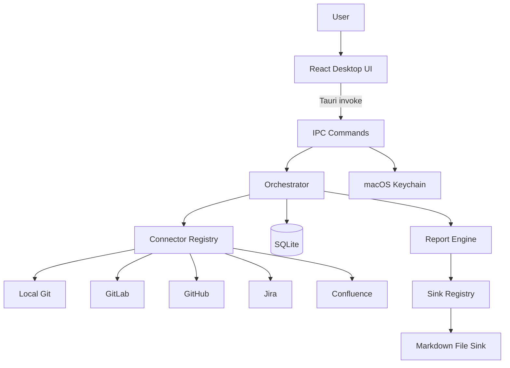

# Holistic release-readiness review

**Date:** 2026-04-24  
**Repo state reviewed:** `master`, app version `0.6.12`  
**Scope:** architecture, security/privacy, integrations, dependencies, performance, UX/design, website, naming, and public release strategy.

This review is a product-and-engineering audit, not a code-change PR. It identifies what is ready for a public release, what should be fixed in the next PR, and what should be tracked as follow-up work.

---

## 1. Executive summary

Dayseam is much closer to a credible public beta than the public-facing repo currently says. The architecture is coherent, the connector model has held through five source types, release engineering has matured, and the app already carries real product polish from repeated dogfood cycles.

The main release blocker is not core architecture; it is **trust and presentation drift**. `README.md` still describes v0.1.0, unsigned first-run, and future Developer ID work, while the code and release docs show `0.6.12` with Developer ID infrastructure implemented. A user arriving today would see an older, rougher product than the repo actually contains.

**Release-readiness verdict:** ready for a public beta after a small docs/privacy/release verification PR. Do not pursue Mac App Store before the direct-download path is polished and notarized in a real production release.

**Highest-priority next PR:**

1. Refresh public docs and app metadata to match the shipped connector set and signing story.
2. Add a short privacy/security document for users.
3. Verify one Developer ID release artifact end-to-end and document the result.
4. Create the website scaffold or at least the website plan and issue set.

---

## 2. Architecture review

Dayseam is a local-first macOS desktop app:

- Frontend: React, TypeScript, Vite, Tailwind in `apps/desktop/src`.
- Shell: Tauri 2 in `apps/desktop/src-tauri`.
- Core domain and IPC types: `crates/dayseam-core`, exported to `packages/ipc-types`.
- Persistence: SQLite via `crates/dayseam-db`.
- Orchestration: `crates/dayseam-orchestrator`.
- Connectors: `crates/connectors/*`.
- Sinks: `crates/sinks/*`.
- Secrets: Keychain-backed storage in `crates/dayseam-secrets`.



### What is strong

- `ARCHITECTURE.md` is unusually complete and still useful as the canonical system map.
- `SourceConnector` / `SinkAdapter` are the right boundaries for a local-first desktop app. The system has already absorbed Local Git, GitLab, GitHub, Jira, and Confluence without a rewrite.
- The default registry has coverage tests that assert every `SourceKind` has a connector, reducing silent "variant added but never wired" bugs.
- Tauri command allowlists are explicit in `apps/desktop/src-tauri/capabilities/default.json`, with updater privileges isolated in `updater.json`.
- The release workflow has evolved from aspirational to operational: CI wait gate, semver labels, updater signing checks, Developer ID mode detection, and notarization runbook.

### What needs attention

- The architecture docs and README disagree on product state. `README.md` says v0.1.0 and Local Git + GitLab; `docs/plan/README.md` and code show GitHub, Jira, Confluence, updater, and 0.6.x releases.
- The "plugin" story should be renamed publicly. Today it is **compile-time extension by crates**, not runtime plugins. That is a good engineering choice for security and reviewability, but "plugin integration" can imply dynamic loading.
- `packages/ui` is still a scaffold. Either make it a real shared design-system package or remove it from the app dependency until it provides value.

---

## 3. User security and privacy

### Strengths

- Long-lived tokens live behind Keychain references, not in SQLite.
- `IpcSecretString` is intentionally one-way: deserialize from IPC, no serialize, redacted `Debug`, and zeroized on drop.
- CSP is strict for a bundled Tauri app: `default-src 'self'; script-src 'self'`.
- The updater capability grants only check, download-and-install, and restart; it avoids broad updater defaults.
- `shell_open` is an explicit command with an allowlisted scheme model and file URL hardening.
- No analytics or third-party telemetry were found in the desktop frontend.

### User-facing risks to disclose

- Dayseam is not sandboxed like a Mac App Store app. `entitlements.plist` includes user-selected read/write access plus JIT/unsigned executable memory allowances needed by the Tauri/WebView stack.
- SQLite stores work activity, raw upstream payload JSON, report drafts, evidence, logs, identities, and source metadata in the local app data directory. This is useful for evidence-linked reports, but it means local disk backups can contain work data.
- User-supplied base URLs are allowed for self-hosted GitLab and GitHub Enterprise. The app will call the host the user configures, including internal hosts. That is correct for this product, but should be explained in enterprise/security docs.
- PATs still cross the WebView-to-Rust IPC boundary once. The Rust side is careful; the renderer and local machine threat model still matter.
- In-app update privileges are powerful if the WebView is ever compromised. Current CSP and no-remote-content posture are the right controls; they should remain guarded.

### Recommended privacy/security doc

Add `docs/privacy-security.md` and link it from `README.md` and the future website. It should answer:

- What data is stored locally?
- Where are tokens stored?
- What leaves the machine?
- Does Dayseam use telemetry?
- How do updates work and what signature is verified?
- What permissions does the macOS build require?
- What is not protected against, such as disk compromise without FileVault?

---

## 4. Integration review

### Current source integrations

| Integration | Assessment | Follow-up |
|---|---|---|
| Local Git | Mature and privacy-aware, including private repo redaction. | Keep improving onboarding copy around scan roots and private repo marking. |
| GitLab | Mature enough for beta; supports validation, reconnect, identity linking, and clear auth errors. | Public docs should mention self-hosted and token scopes clearly. |
| GitHub | Shipped and wired through `SourceKind`, registry, UI, and report sections. | README still omits it from the current headline. |
| Jira | Shipped as part of Atlassian support with shared credential story. | Website should explain read-only scope and ticket-key enrichment. |
| Confluence | Shipped with Jira sibling support and email repair for legacy rows. | Website should frame it as supporting "docs/comments evidence", not as a broad Confluence automation tool. |

### Sinks and future integrations

The only shipping sink is markdown file output, which is the right first sink for a local-first app and Obsidian users. Future sinks should remain explicit write destinations; do not blur "read-only sources by default" with automatic publishing.

For future integrations, keep the existing crate-per-connector model. Runtime plugin loading would add signing, sandboxing, upgrade, and trust complexity before the product needs it.

---

## 5. Dependency and version review

| Area | Finding | Priority |
|---|---|---|
| Node types | `apps/desktop` and `e2e` use `@types/node` `^25.6.0`, while CI runs Node 20. | Medium |
| React hooks lint | `eslint-plugin-react-hooks` is `^5.0.0-canary`. | Medium |
| Vite / Vitest / TS | Vite 5, Vitest 2, and TypeScript 5.5 are stable but no longer current. | Low |
| Tauri packages | Tauri packages are `^2.x`, which allows drift; release builds should stay tested after upgrades. | Low |
| Rust `tokio` | Workspace dependency enables `features = ["full"]`. | Low/Medium |
| `thiserror` | Workspace uses `thiserror = "1"`; current ecosystem has moved to newer major versions. | Low |
| Stub lint | `packages/ui` and `packages/ipc-types` lint scripts are no-ops. | Low |

Recommended dependency track:

1. Align `@types/node` to Node 20 first; this is the least controversial fix.
2. Replace the React hooks canary with a stable release if available.
3. Run `cargo tree -d`, `cargo machete`, `cargo deny check`, and `cargo audit` as the dependency hygiene baseline.
4. Defer Tauri/Vite major upgrades until after the website/public beta docs PR unless a security advisory requires them.

---

## 6. Performance and efficiency

### Highest-confidence opportunity: markdown sink blocking IO

`MarkdownFileSink::write` is an async trait method, but it calls synchronous filesystem functions through `write_one`, including lock acquisition, reading existing markdown, marker parsing, and atomic write. For normal daily notes this is fine, but on slow disks, network folders, iCloud/Dropbox-backed vaults, or many destinations, this can block a runtime worker.

Recommended follow-up: wrap the per-destination write in `tokio::task::spawn_blocking` or move the sink onto a dedicated blocking boundary. Keep cancellation checks before each destination and preserve the current partial-success semantics.

### Other efficiency ideas

- Trim `tokio` features per crate after release-readiness docs are corrected.
- Add a bundle analysis script before optimizing frontend splitting. No `React.lazy` usage exists today, but the app is not large enough to justify speculative code splitting before measuring.
- Keep connector fan-out bounded. The existing semaphore pattern in generation is the right direction.
- Consider a lightweight "diagnostics export" for users reporting slow syncs: app version, source kinds, durations, retry counts, and redacted error classes.

---

## 7. Static bug-risk inventory

### Fix in the next PR if possible

| Id | Risk | Evidence | Suggested action |
|---|---|---|---|
| DOC-1 | Public README materially undersells and misstates release state. | `README.md` points to v0.1.0, unsigned first-run, and closed #59. | Refresh README and release copy. |
| DOC-2 | App bundle long description only mentions local git and GitLab. | `tauri.conf.json` `longDescription`. | Include GitHub, Jira, Confluence, and markdown/Obsidian output. |
| PRIV-1 | No public privacy/security doc despite local raw payload storage. | `raw_payloads.payload_json`, report drafts, logs in SQLite. | Add `docs/privacy-security.md`. |
| REL-1 | Need proof that a real public release ran in Developer ID mode. | `CODESIGN.md` says infrastructure is opt-in by secrets. | Verify latest release artifact or run dry-run before public push. |

### Track for follow-up

| Id | Risk | Suggested issue |
|---|---|---|
| PERF-1 | Markdown sink uses synchronous filesystem operations in async `write`. | Move writes to blocking boundary or benchmark first. |
| DEP-1 | Dependency hygiene drift. | Align Node types and canary lint package; audit upgrade path. |
| UX-1 | No screenshots, GIFs, or website-quality visual assets in repo. | Capture release screenshots/demo reel. |
| WEB-1 | No public website. | Build marketing site. |
| MAS-1 | Mac App Store path is not planned against sandbox/legal constraints. | Feasibility spike only, not immediate release path. |
| PLUG-1 | Public "plugin" wording may overpromise runtime plugin support. | Rename to "connector architecture" unless runtime plugins are planned. |

---

## 8. Desktop UX and design improvements

Dayseam already has a stronger UX loop than many pre-1.0 desktop apps: first-run empty state, source health chips, reconnect paths, streaming preview, updater banner, scheduler catch-up, log drawer, and theme hydration before paint.

Recommended polish:

- Use the next PR to align naming and copy across README, app metadata, and website: "local-first work reports from evidence" should be the primary phrase.
- Add in-product "Privacy & local data" entry in Preferences or About once the privacy doc exists.
- Capture a short screenshot set: first-run setup, connected sources, generating state, evidence-linked report preview, save to Obsidian.
- Either load Inter explicitly or remove it from `tailwind.config.ts`; currently `index.html` does not load Inter.
- Keep motion modest and respect `prefers-reduced-motion`, as the current splash and spinner work already do.
- Consider an onboarding checklist that shows "Connect one source", "Generate your first report", "Save to markdown/Obsidian", and "Set update preferences".

---

## 9. Website plan

### Recommended stack

Use **Astro + TypeScript + Tailwind** with small React islands only where interaction is needed. This fits the product because the site is mostly static, SEO-friendly, and documentation-heavy, but can still support tasteful scroll-driven sections.

Why not a full Next.js app right now:

- No backend or auth is needed for marketing.
- Downloads can link to GitHub Releases.
- Docs can live as MDX.
- Astro keeps the site fast by default and avoids shipping React for static sections.

### Proposed structure

```text
apps/website/
  src/pages/index.astro
  src/pages/privacy.astro
  src/pages/download.astro
  src/pages/docs/[...slug].astro
  src/components/
  src/content/docs/
```

### Landing page narrative

1. Hero: "Your workday, stitched from evidence."
2. Dynamic scroll section: tool cards flow into one report timeline.
3. Trust section: local-first, no mandatory account, tokens in Keychain, no telemetry.
4. Integrations: Local Git, GitLab, GitHub, Jira, Confluence, Markdown/Obsidian.
5. Product demo: generated report with evidence chips.
6. Download CTA: macOS today, Windows/Linux later.
7. Open source / AGPL section.

### Visual direction

The "cool scroll dynamic" effect should show evidence fragments from different tools converging into a clean report, not decorative parallax for its own sake. Use CSS scroll timelines or a small React island with Framer Motion only if needed. Keep a no-motion fallback.

---

## 10. Naming and positioning

### Recommendation

Keep **Dayseam** as the product name. It is already embedded in bundle metadata, docs, splash UI, versioning, and the repo identity. The metaphor works: stitching the day together from evidence.

Live RDAP checks during this review returned no registration for `dayseam.com`, `dayseam.app`, and `dayseam.dev`, which makes the current name stronger than the first-pass alternate list. Domain availability can change quickly and should be rechecked immediately before purchase, but the current signal favors buying the Dayseam domains instead of renaming.

### Tagline options

- Dayseam: evidence-linked work reports, generated locally.
- Dayseam: your workday, stitched from the tools you already use.
- Dayseam: turn commits, tickets, and docs into a daily report.
- Dayseam: local-first work reporting for developers.

### Name and domain shortlist

| Name | Domain signal from RDAP checks | Assessment |
|---|---|---|
| **Dayseam** | `dayseam.com`, `dayseam.app`, and `dayseam.dev` returned available. | Best option. Already in product, distinctive enough, and the key domains appear open. |
| **Dailyseam** | `dailyseam.com`, `dailyseam.app`, and `dailyseam.dev` returned available. | Good fallback if "Dayseam" feels too coined, but slightly less elegant. |
| **Workstitch** | `workstitch.app` and `workstitch.dev` returned available; `workstitch.com` is registered. | Clear meaning, weaker because `.com` is taken. |
| **Workdaybook** | `workdaybook.com`, `workdaybook.app`, and `workdaybook.dev` returned available. | Descriptive and available, but more generic and less ownable. |
| **Tracewright** | `tracewright.app` and `tracewright.dev` returned available; `tracewright.com` is registered. | Strong craft feel, but less obvious for daily work reports. |
| **Daythread** | `daythread.dev` returned available; `daythread.com` and `daythread.app` are registered. | Good metaphor, but weaker domain position. |
| **ProofNote** | `proofnote.dev` returned available; `proofnote.com` and `proofnote.app` are registered. | Too close to notes/proofing; weaker domain position. |
| **Workloom** | `workloom.com`, `workloom.app`, and `workloom.dev` are registered. | Drop from shortlist despite good metaphor. |
| **Threadline** | `threadline.com`, `threadline.app`, and `threadline.dev` are registered. | Drop from shortlist despite good sound. |

Best short list: **Dayseam**, **Dailyseam**, **Workdaybook**. The practical recommendation is to keep Dayseam and buy `dayseam.com`, `dayseam.app`, and `dayseam.dev` before announcing the public beta.

---

## 11. Release strategy

### Direct download first

The fastest smooth user experience is Developer ID signing + notarization + GitHub Releases + Tauri updater:

1. Confirm repo secrets are configured for Developer ID mode.
2. Run a release dry-run and verify Gatekeeper acceptance.
3. Cut a real release and download the public DMG.
4. Verify `codesign`, `spctl`, and `stapler` results using `docs/release/CODESIGN.md`.
5. Update README and website to remove unsigned-first-run copy for official releases.

### Mac App Store later

Do not make Mac App Store the initial public release path. It needs a separate feasibility spike:

- App Sandbox changes and entitlement reduction.
- Tauri/WebView JIT/unsigned executable memory compatibility.
- User-selected folder access and security-scoped bookmarks.
- Keychain access groups and migration from Developer ID builds.
- In-app updater removal or alternate update story.
- AGPL/commercial licensing review.
- Apple review concerns around developer-tool connectors and tokens.

The Mac App Store may be valuable later for trust and discovery, but it is a different product distribution architecture.

---

## 12. GitHub issue reconciliation plan

Current open issues reviewed:

- #129 tracks remaining v0.5 follow-ups. It now appears mostly complete, with remaining process/repo-settings items.
- #61 tracks graphify re-evaluation. It remains valid as a low-priority architectural trigger issue.

Issue actions completed from this review:

1. Created [#139](https://github.com/vedanthvdev/dayseam/issues/139) for README/app metadata/public docs refresh.
2. Created [#140](https://github.com/vedanthvdev/dayseam/issues/140) for privacy/security disclosure.
3. Created [#141](https://github.com/vedanthvdev/dayseam/issues/141) for website launch.
4. Created [#142](https://github.com/vedanthvdev/dayseam/issues/142) for dependency hygiene.
5. Created [#143](https://github.com/vedanthvdev/dayseam/issues/143) for markdown sink blocking IO.
6. Created [#144](https://github.com/vedanthvdev/dayseam/issues/144) for Developer ID artifact verification.
7. Created [#145](https://github.com/vedanthvdev/dayseam/issues/145) for Mac App Store feasibility.
8. Commented on [#129](https://github.com/vedanthvdev/dayseam/issues/129) with this review context rather than closing it, because it still contains repo-settings/process items.
9. Left [#61](https://github.com/vedanthvdev/dayseam/issues/61) open; the current repo still matches its defer criteria.

---

## 13. Verification status

Local verification run during this audit:

| Check | Result |
|---|---|
| `git status --short` | Passed; only this review doc was untracked before verification. |
| `pnpm -r lint` | Passed. Note: `packages/ui` and `packages/ipc-types` currently have no-op lint scripts, which is tracked as a hygiene finding above. |
| `pnpm -r typecheck` | Passed. |
| `pnpm --filter @dayseam/desktop test` | Passed: 44 test files, 283 tests. |
| `cargo fmt --all -- --check` | Passed. |
| `cargo clippy --workspace --all-targets -- -D warnings` | Passed. |
| `cargo test --workspace --all-features` | Passed. |

Not run in this pass: Playwright E2E and a real Developer ID release dry-run. Both belong in the public-release readiness branch or release checklist.

---

## 14. Recommended immediate PR scope

Keep the next PR focused on public readiness, not feature work:

- Refresh `README.md`.
- Update `tauri.conf.json` `longDescription`.
- Add `docs/privacy-security.md`.
- Add release verification notes after a Developer ID dry-run or production artifact check.
- Link this review from `docs/plan/README.md` or `ARCHITECTURE.md` only if you want it to become part of the canonical review trail.

Defer implementation-heavy work like markdown sink async IO, dependency upgrades, and website build to separate branches.
